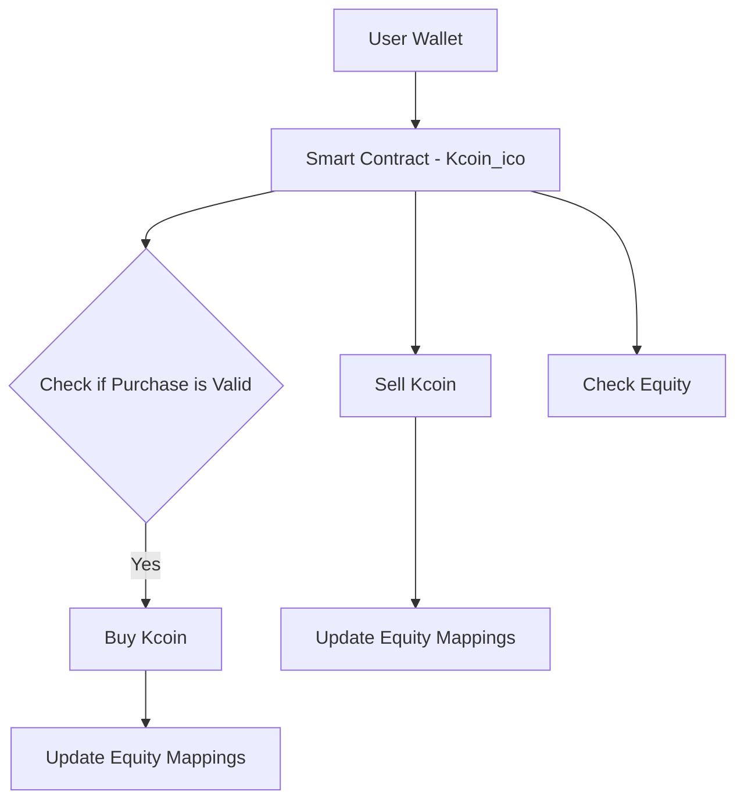

# Kcoin ICO Smart Contract

This smart contract implements a basic Initial Coin Offering (ICO) for **Kcoin**. It allows investors to buy and sell Kcoin using USD, and check their equity in both Kcoin and USD. The contract is written in Solidity and is compatible with the Ethereum Virtual Machine (EVM).

## 🔧 Features

* 🪙 **Buy Kcoin** using USD (1 USD = 1 Kcoin).
* 💵 **Sell Kcoin** to redeem USD (1 Kcoin = 1 USD).
* 📊 **Check Equity** in both Kcoin and USD.
* 🔐 Protects investors from buying more than the total Kcoin supply.

## 🧪 Tech Stack

* Language: Solidity `0.8.30`

## 🚀 Getting Started

### Prerequisites

* Code is build using [Remix IDE](https://remix.ethereum.org/) and tested on Environment **Remix VM (Prague)**

### Compile and Run

1. Solidity Compiler
<p align="center"></p>

2. Deploy and Run Transaction
<p align="center"></p>

3. Deploy Contracts
<p align="center"></p>

4. Expand BUY_KCOIN
<p align="center"></p>

5. Input values for Public Address and USD
<p align="center"></p>


### Key Contract Functions

#### Buy Kcoin

```solidity
function buy_kcoin(address investor, uint usd_to_invest) public can_buy_kcoin(usd_to_invest)
```

* Allows the investor to buy Kcoin based on the amount of USD invested.

#### Sell Kcoin

```solidity
function sell_kcoin(address investor, uint kcoin_to_sell) public
```

* Allows the investor to sell their Kcoin for equivalent USD.

#### Check Equity

```solidity
function equity_in_kcoin(address investor) public view returns (uint)
function equity_in_usd(address investor) public view returns (uint)
```

* Returns the investor’s balance in Kcoin and USD respectively.

## 📈 Variables

| Variable             | Description                                |
| -------------------- | ------------------------------------------ |
| `max_kcoin`          | Total supply of Kcoin (100,000)            |
| `one_usd_to_kcoin`   | Exchange rate (1 USD = 1 Kcoin)            |
| `one_kcoin_to_usd`   | Reverse exchange rate (1 Kcoin = 1 USD)    |
| `total_kcoin_bought` | Tracks how many Kcoins have been purchased |
| `equity_kcoin`       | Mapping of user Kcoin balances             |
| `equity_usd`         | Mapping of user USD-equivalent balances    |

## 🖼 Architecture


